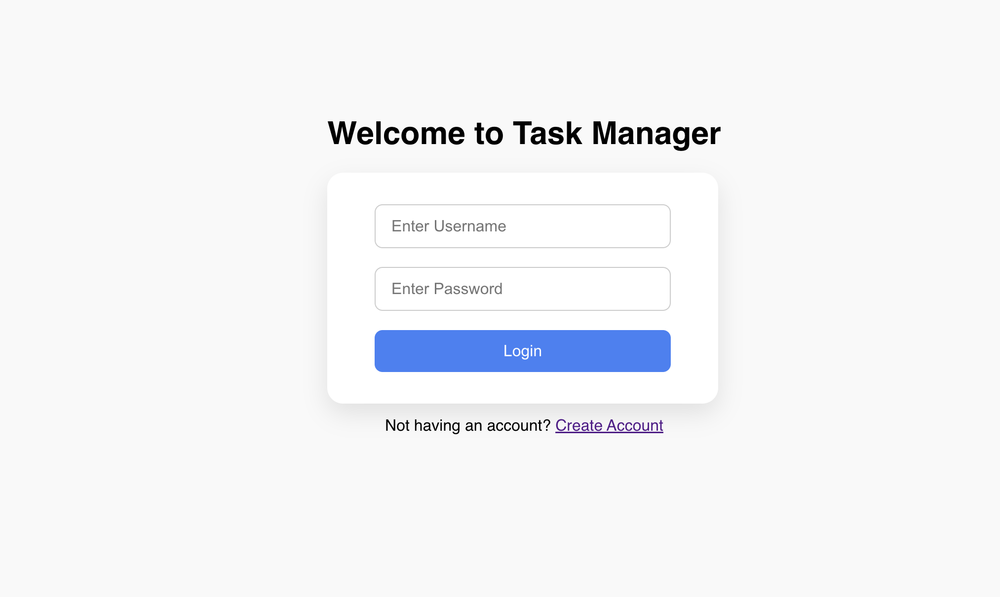
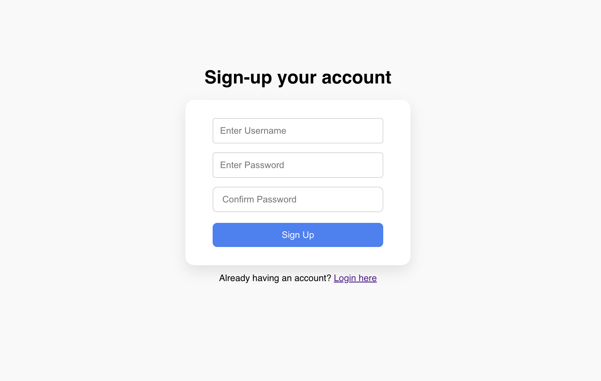
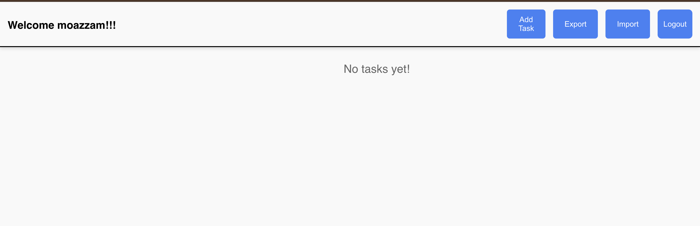
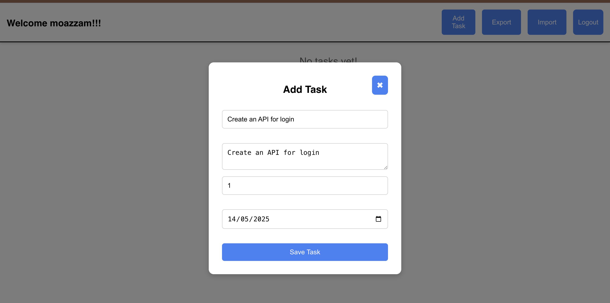
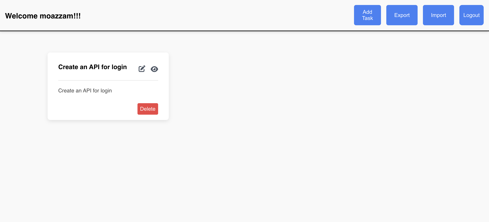
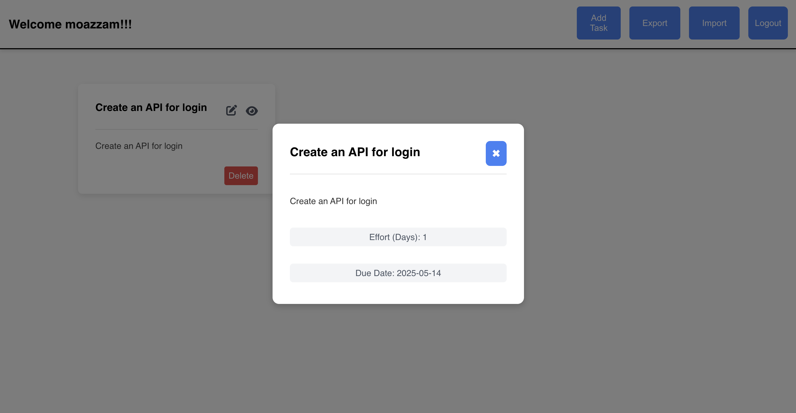
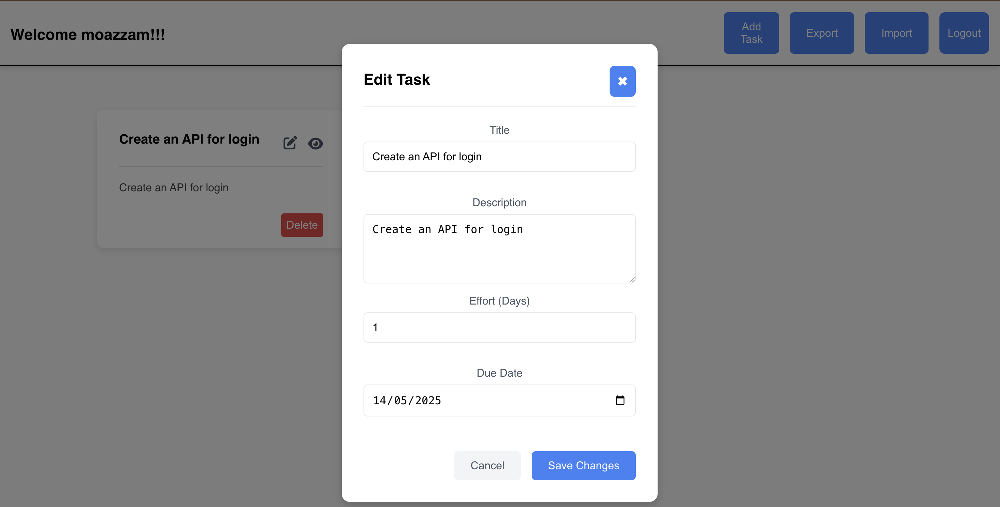

# Living Things - Task Management System

A full-stack web application built with Django and React for managing tasks with import/export capabilities.

## Features

- **Task Management**
  - Create new tasks
  - View task details
  - Update existing tasks
  - Delete tasks
  - List all tasks

- **Data Import/Export**
  - Export all tasks to Excel/CSV format
  - Import tasks from Excel/CSV files
  - Bulk task management

- **User Features**
  - User-specific task lists
  - Secure authentication
  - Personal task management

## Project Structure

```
living-things/
├── backend/         # Django backend
│   ├── living_things/  # Django project settings
│   ├── tasks/      # Task management app
│   └── requirements.txt
└── frontend/       # React frontend
    ├── src/        # React source code
    └── public/     # Static files
```

## Prerequisites

- Python 3.8 or higher
- Node.js 14 or higher
- npm or yarn
- MySQL (Database)

## Screenshots

### Authentication

*Login page with secure authentication*


*Register page*

### Dashboard

*Main dashboard showing task list and management options*

### Task Management

*Add new task modal*


*View all tasks*


*View task details modal*


*Edit task modal*


## Backend Setup

1. Navigate to the backend directory:
   ```bash
   cd backend
   ```

2. Create and activate a virtual environment:
   ```bash
   python -m venv venv
   source venv/bin/activate  # On Windows: venv\Scripts\activate
   ```

3. Install dependencies:
   ```bash
   pip install -r requirements.txt
   ```

4. Configure database settings in `living_things/settings.py`

5. Run migrations:
   ```bash
   python manage.py migrate
   ```

6. Start the development server:
   ```bash
   python manage.py runserver
   ```

The backend server will run on http://localhost:8000

## Frontend Setup

1. Navigate to the frontend directory:
   ```bash
   cd frontend
   ```

2. Install dependencies:
   ```bash
   npm install
   # or
   yarn install
   ```

3. Start the development server:
   ```bash
   npm start
   # or
   yarn start
   ```

The frontend development server will run on http://localhost:3000

## API Endpoints

### Task Management
- `GET /api/tasks` - List all tasks
- `POST /api/tasks` - Create a new task
- `GET /api/tasks/{id}` - Get task details
- `PUT /api/tasks/{id}` - Update a task
- `DELETE /api/tasks/{id}` - Delete a task

### Import/Export
- `POST /api/tasks/import` - Import tasks from Excel/CSV

## Development

- Frontend development server includes hot-reloading
- Backend development server includes auto-reloading